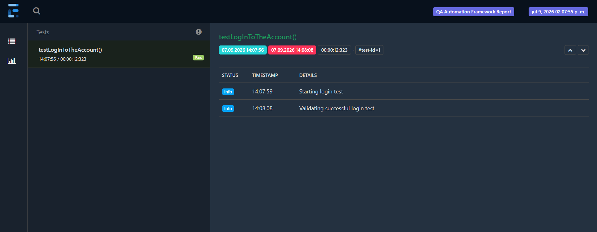
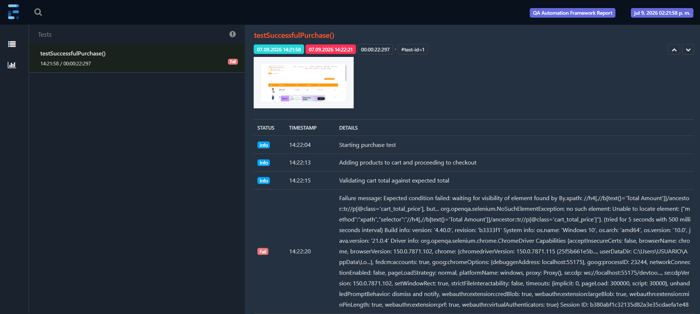

# QA Automation Framework - Selenium Java

A UI test automation framework built using Selenium WebDriver and Java. The project follows the Page Object Model (POM)
design pattern and includes reusable utilities, dynamic test data generation, configurable browser execution, and
ExtentReports integration.

## 🛠️ Technologies
- Java
- Selenium WebDriver
- JUNit 5
- Gradle
- Java Faker
- Extent Reports

## 🧱 Framework Design
- Page Object Model (POM)
- BasePage for common actions
- Custom Wait Utilities
- External configuration management
- Driver Factory for centralized WebDriver management
- Test Data Factory for dynamic data generation
- ExtentReports integration

## 📂 Project Structure
```
src
├── main
│   ├── java
│       ├── com.test.automationexercise
│           ├── pages
│           └── utils
│   └── resources
│       └── config.properties
│
├── test
│   └── java
│       ├── com.test.automationexercise
│           ├── base
│           ├── reports
│           └── tests
│   └── resources
│
test-output
```

## ✅ Test Scenarios
### Positive Scenarios
- User can sign up successfully
- User can log in with valid credentials
- Successful purchase with total cart validation
- Sending contact form successfully

### Negative Scenarios
- Log in with wrong credentials
- Sign up with existing email

## 📈 Reporting
The framework uses ExtentReports for test execution reporting.

### Report Features:
- Step-by-step execution logs
- Failure messages
- Automatic screenshots on test failures
- Execution timestamps

### Generated artifacts:
- test-output/TestReport.html
- test-output/screenshots/

### When a test fails:
- A screenshot is automatically captured.
- The screenshot is attached to the ExtentReport.
- The failure message is logged in the report.

### Example Report



#### Screenshot on Failure



## 🚀 How to Run
### Prerequisites
- Java 21
- Google Chrome
- Gradle

### Clone the Repository
```git clone https://github.com/Daniela-AC/qa-automation-framework-selenium-java-automation-exercise.git```

```cd qa-automation-framework-selenium-java```

### Install dependencies
```./gradlew build```

### Run all tests
```/gradlew test```

### Run a specific test class
```/gradlew test --tests LoginTest```

### Reports location
The ExtentReport is automatically generated after test execution and can be found at:

test-output/TestReport.html

## 📌 Notes
This project demonstrates the implementation of a maintainable Selenium automation framework using industry-standard 
design patterns and best practices.

## Future Improvements
- GitHub Actions CI integration
- Parallel execution
